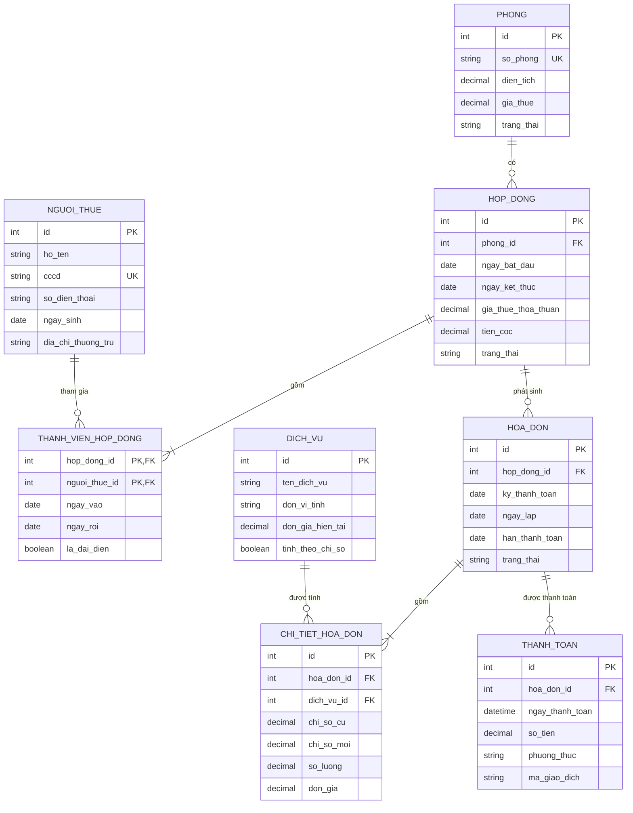

```mermaid
erDiagram
    PHONG ||--o{ HOP_DONG : "có"
    HOP_DONG ||--|{ THANH_VIEN_HOP_DONG : "gồm"
    NGUOI_THUE ||--o{ THANH_VIEN_HOP_DONG : "tham gia"
    HOP_DONG ||--o{ HOA_DON : "phát sinh"
    HOA_DON ||--|{ CHI_TIET_HOA_DON : "gồm"
    DICH_VU ||--o{ CHI_TIET_HOA_DON : "được tính"
    HOA_DON ||--o{ THANH_TOAN : "được thanh toán"

    PHONG {
        int id PK
        string so_phong UK
        decimal dien_tich
        decimal gia_thue
        string trang_thai
    }

    NGUOI_THUE {
        int id PK
        string ho_ten
        string cccd UK
        string so_dien_thoai
        date ngay_sinh
        string dia_chi_thuong_tru
    }

    HOP_DONG {
        int id PK
        int phong_id FK
        date ngay_bat_dau
        date ngay_ket_thuc
        decimal gia_thue_thoa_thuan
        decimal tien_coc
        string trang_thai
    }

    THANH_VIEN_HOP_DONG {
        int hop_dong_id PK,FK
        int nguoi_thue_id PK,FK
        date ngay_vao
        date ngay_roi
        boolean la_dai_dien
    }

    HOA_DON {
        int id PK
        int hop_dong_id FK
        date ky_thanh_toan
        date ngay_lap
        date han_thanh_toan
        string trang_thai
    }

    DICH_VU {
        int id PK
        string ten_dich_vu
        string don_vi_tinh
        decimal don_gia_hien_tai
        boolean tinh_theo_chi_so
    }

    CHI_TIET_HOA_DON {
        int id PK
        int hoa_don_id FK
        int dich_vu_id FK
        decimal chi_so_cu
        decimal chi_so_moi
        decimal so_luong
        decimal don_gia
    }

    THANH_TOAN {
        int id PK
        int hoa_don_id FK
        datetime ngay_thanh_toan
        decimal so_tien
        string phuong_thuc
        string ma_giao_dich
    }
```
